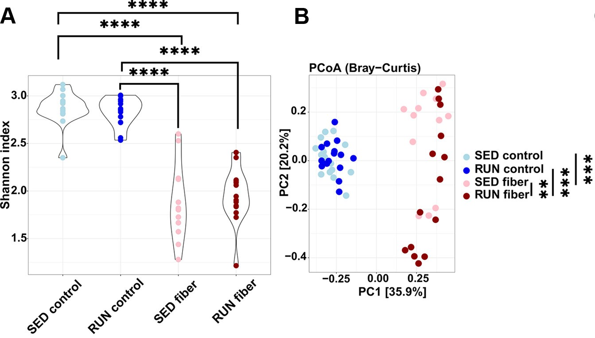
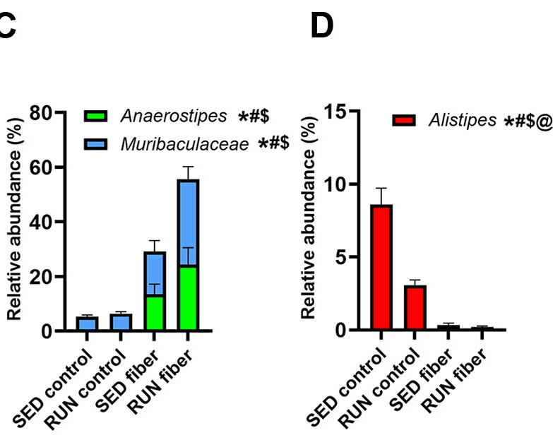
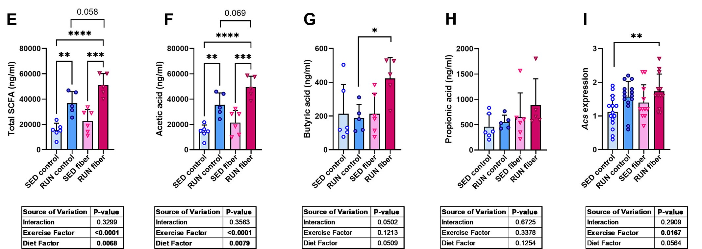

### PROJEKT NA ZAJĘCIA NR 2: Exploratory vs Explanatory
# This script aimed to recreate the data visualization presented in the paper:

**"Interplay between climate and carbon cycle feedbacks could substantially enhance future warming"**  
Christine Kaufhold, Matteo Willeit, Stefanie Talento, Andrey Ganopolski, and Johan Rockström.  
(2025). Interplay between climate and carbon cycle feedbacks could substantially enhance future warming.  
*Environmental Research Letters*, 20(4), 044027.  
DOI: [10.1088/1748-9326/adb6be](https://doi.org/10.1088/1748-9326/adb6be)

    BUT THE AUTHORS DID NOT SUPPLY THE DATA! LIARRRRRRRRRRRRRRRRRRRRRRS!
# So I will use the data from MY PAPER:

**"Combination of dietary fiber and exercise training improves fat loss in mice but does not ameliorate MASLD more than exercise alone"**  
Artemiy Kovynev, <span style="background: linear-gradient(to right, red, orange, yellow, green, blue, indigo, violet); -webkit-background-clip: text; color: transparent; font-weight: bold;">Mikołaj M. Charchuta</span>, Amina Begtašević, Quinten R. Ducarmon, Patrick C. N. Rensen, and Milena Schönke.
(2025). Combination of dietary fiber and exercise training improves fat loss in mice but does not ameliorate MASLD more than exercise alone.  
*American Journal of Physiology-Gastrointestinal and Liver Physiology*.  
DOI: [10.1152/ajpgi.00317.2024](https://doi.org/10.1152/ajpgi.00317.2024)

```{r project_exploratory_vs_explanatory, message=FALSE, warning=FALSE}
# Load necessary libraries
library(tidyverse)
library(ggplot2)
library(plotly)
``` 

#### **Exploratory Visualization**
```{r exploratory_visualization, message=FALSE, warning=FALSE}
# Exploratory visualization: 

```

#### **Explanatory Visualization**
```{r explanatory_visualization, message=FALSE, warning=FALSE}
# Explanatory visualization:

```

#### **Mixed Visualization**
```{r mixed_visualization, message=FALSE, warning=FALSE}
# Mixed visualization: Combining exploratory and explanatory

```